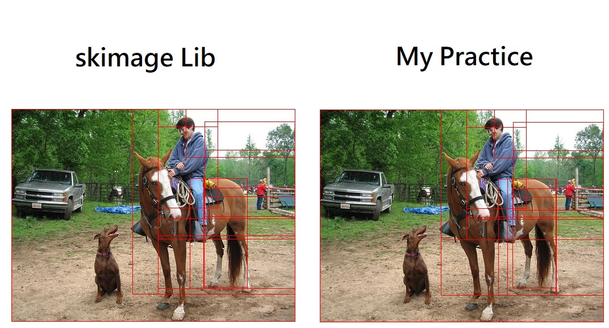
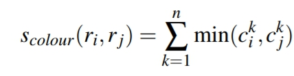
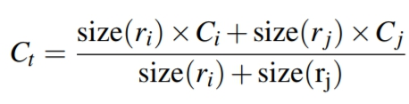
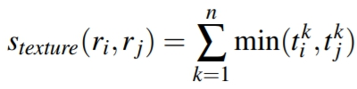
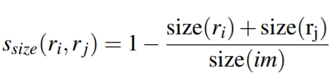
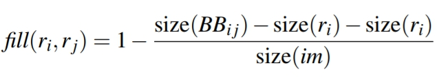
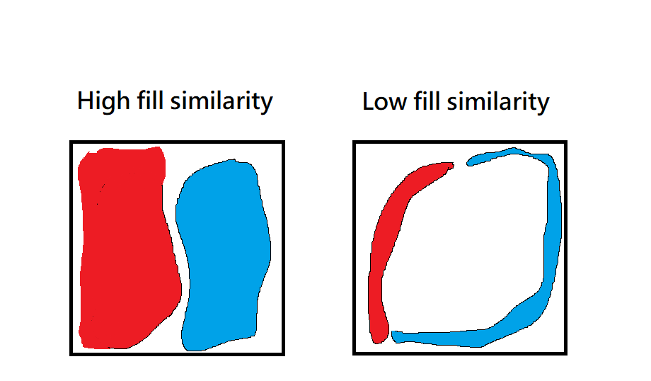

# Selective-Search
- This approach is used to get region proposals in **Fast-RCNN**.
- [for more detail](http://www.huppelen.nl/publications/selectiveSearchDraft.pdf)
# Setup
- Windows 10
- Python 3.6

# Result
  

# Detail

**1. Selective Search uses graph-based image segmentation to get initial regions, first.**  
   In my practice, I just used the function of graph-based image segmentation in openCV.

**2. Calculate similarities between each neighboring region.**  

   **_Following are 4 similarity approaches in this paper._**  
   
   **A. _color similarity_**:  

      In order to measure the similarity in color, this approach can measure color distribution  
      of each region.  
      Calculate color histogram of each region, than sum up the minimize interval between both  
      neighboring regions.  

  

      We can easily get the color similarity after merge two region by using following algorithm.

  

   **B. _texture similarity_:**  

      Similar objects have more similar texture features, so we measure the texture similarities  
      between each neighboring region to merge complete object.  
      In this paper, they use SIFT to get image textures.  
      In my practice, I used LBP instead.  

  

   **C. _size similarity_:**  

      To avoid all regions be merged by a big region.  

  

   **D. _fill similarity_:**  

      Merge the regions which has the least hole after merging.  
  
  

   Following are two bounding boxes with same widths and heights, show what is the least **_hole_**.  

  

**3. Merge the highest similarity of two regions, iteratively.**  
