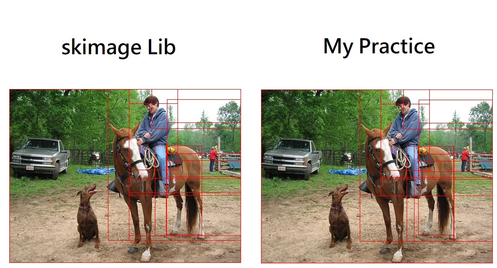
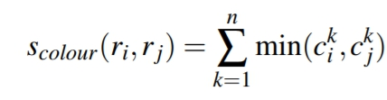
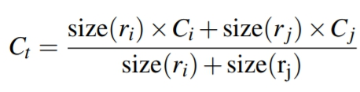
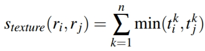
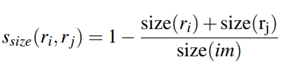
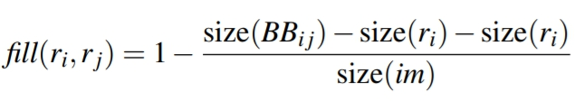

# Seletive-Search
- [more detail] (http://www.huppelen.nl/publications/selectiveSearchDraft.pdf)
# Setup
- Windows 10
- Python 3.4

# Result


# Detail
```
1- Selective Search uses graph-based image segmentation to get initial regions, first.
   In my practice, I just use the function of graph-based image segmentation in openCV.

2- Calculate similarities between each neighboring region.
    A. color similarity:
       In order to measure the similarity in color, this approach can measure distribution
       of each region.
       calculate color histogram of each region, than calculate the sum of minimize
       similarity in each interval between both neighboring regions.
```
       
```
       We can easily get the color similarity after merge two region by using following
       algorithm.
```
       
```
    B. texture similarity:
       In this paper, they use SIFT to get image textures.
       In my practice, I use LBP instead.
```
       
    C. size similarity:
       
    D. fill similarity:
       
3
```
