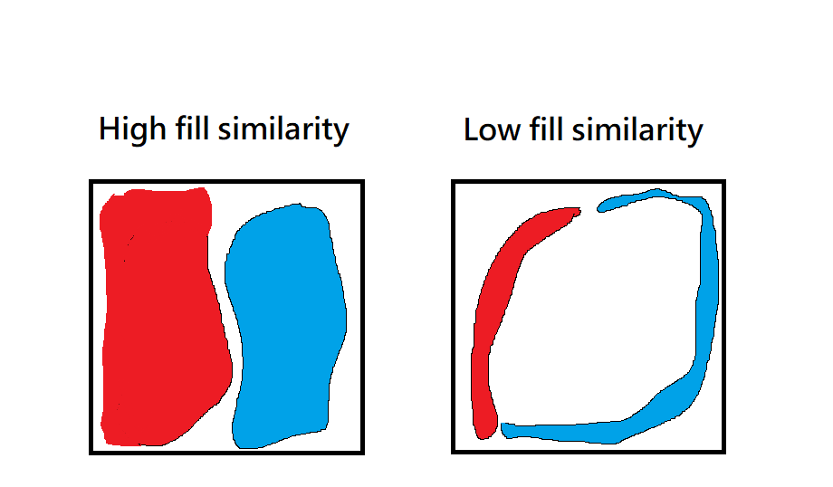

# Seletive-Search
- [more detail](http://www.huppelen.nl/publications/selectiveSearchDraft.pdf)
# Setup
- Windows 10
- Python 3.4

# Result


# Detail

1. Selective Search uses graph-based image segmentation to get initial regions, first.  
   In my practice, I just use the function of graph-based image segmentation in openCV.

2. Calculate similarities between each neighboring region.  
   A. **_color similarity_:**
       In order to measure the similarity in color, this approach can measure color distribution
       of each region.
       calculate color histogram of each region, than calculate the sum of minimize
       similarity in each interval between both neighboring regions.

  

       We can easily get the color similarity after merge two region by using following
       algorithm.

  

   B. **_texture similarity_:**
       Similar objects have more similar texture features, so we measure the texture similarities  
       between each neighboring region to merge complete object.  
       In this paper, they use SIFT to get image textures.  
       In my practice, I use LBP instead.  

  

   C. **_size similarity_:**
       To avoid all regions be merged by a big region.
  

   D. **_fill similarity_:**
       Merge the regions which have the least **_hole_** after merging.
  
  
3.

```
